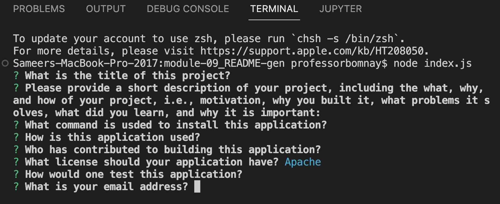

#Module 9 Challenge
###Generate a README file.

1. Open 'index.js' in the intergrated Terminal.

2. Type 'node index.js' and press 'return', or 'enter' for PC, to start the questionnaire that will create your README.md.

3. Fill out each question

What is the title of this project?

Please provide a short description of your project, including the what, why, and how of your project, i.e., motivation, why you built it, what problems it solves, what did you learn, and why it is important.

What command is used to install this application?

How is this application used?

Who has contributed to building this application?

What license should your application have? (Use arrow keys)

How would one test this application?

What is your email address?

What is your github?

Finished README
